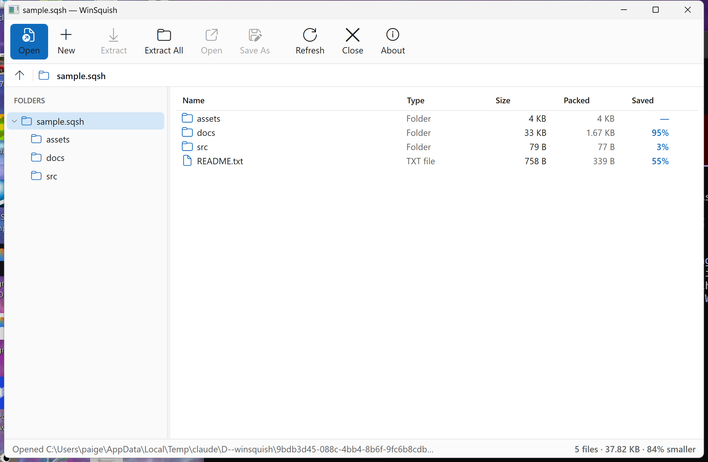

# WinSquish

A Windows file-manager for [SQUISH](../squish) archives — browse a `.sqsh`
archive like a folder, drill into its tree, and extract files without inflating
the rest. Built as a **WPF (.NET 10) desktop app** over the native `libsquish`
(`squish.dll`) through a thin P/Invoke layer.



## What it does

- **Open & browse** any SQUISH archive — an Explorer-style layout with a folder
  tree, a details list (name · type · size · packed size · % saved), a
  breadcrumb, and a status bar. Folder rows show aggregated sizes and ratios.
- **Extract** the whole archive, a selected subtree, or a single file — each
  member seeks straight to its own blocks, so you never inflate the rest.
- **Preview** a file: double-click to extract it to a temp folder and open it in
  its default app. **Save As** writes one file wherever you choose.
- **Create** a new archive by compressing a folder (uses all cores).
- **Multi-select** with Ctrl/Shift click, `Ctrl+A` select-all, a right-click
  context menu (Open · Extract · Save As · Select All · Extract All), and
  **drag files straight out to Explorer**.
- **Drag & drop** an archive onto the window to open it.

Every extraction is checksum-verified by libsquish (each coded block carries a
32-bit checksum of its original bytes).

## Windows shell integration

WinSquish registers itself as the handler for `.sqsh` / `.sq` and adds Explorer
right-click menus. The app is the single source of truth — it writes the keys
itself, so the installer just calls it:

```
WinSquish.exe --register [--allusers] [--quiet]     # HKLM with --allusers, else HKCU
WinSquish.exe --unregister [--allusers] [--quiet]
```

That adds:

- On a `.sqsh` / `.sq` file: **Open with WinSquish**, **Extract Here**,
  **Extract to folder\\** — each is a one-shot GUI action with a progress window.
- On any folder: **Compress to SQUISH archive** → `<folder>.sqsh`.

The same one-shot actions are available on the command line:

```
WinSquish.exe archive.sqsh            # open & browse
WinSquish.exe --extract-here a.sqsh   # extract into the archive's own folder
WinSquish.exe --extract-to   a.sqsh   # extract into a subfolder named after it
WinSquish.exe --compress     path     # compress a file or folder to path.sqsh
```

You can also click **“Make WinSquish the default for .sqsh files”** on the
welcome screen to register for your account (no admin needed).

## Installer

An [Inno Setup](https://jrsoftware.org/isinfo.php) installer builds a single
`winsquish-setup.exe` that installs a self-contained build (no .NET runtime
prerequisite), offers per-user or all-users scope, wires up the file
associations and context menus via `--register`, and cleanly unregisters on
uninstall.

```bat
REM needs Inno Setup 6.3+ on PATH or in Program Files
installer\build-installer.bat
REM -> build\winsquish-setup.exe
```

### Code signing

The build signs everything with
[Azure Trusted Signing](https://learn.microsoft.com/azure/trusted-signing/):
the app binaries (`WinSquish.exe`, `WinSquish.dll`, `squish.dll`) **and** the
installer plus its embedded uninstaller, SHA-256 and RFC-3161 timestamped.

Signing is driven by `installer\sign.bat` — a wrapper around the
[`sign`](https://github.com/dotnet/sign) dotnet tool — and turns on
automatically whenever `installer\signer.json` is present. That file holds the
Trusted Signing account details; they are **identifiers only, no secrets**, so
it is committed:

```json
{
  "endpoint": "https://eus.codesigning.azure.net/",
  "account": "SullivanTechnology",
  "certificateProfile": "Personal",
  "timestampUrl": "http://timestamp.acs.microsoft.com/"
}
```

Authentication uses your Azure credentials through the tool's
`DefaultAzureCredential` chain — no key material ever touches the repo:

- **Locally** — run `az login` once.
- **CI** — set `AZURE_TENANT_ID` / `AZURE_CLIENT_ID` / `AZURE_CLIENT_SECRET`,
  or use a managed / workload identity.

Install the signing tool once, then just build:

```powershell
dotnet tool install --global sign --prerelease   # one-time prerequisite

installer\build-installer.bat   # everything comes out signed + timestamped
```

Any `SIGN_ENDPOINT`, `SIGN_ACCOUNT`, `SIGN_CERTIFICATE_PROFILE`, or
`SIGN_TIMESTAMP_URL` environment variable overrides the matching `signer.json`
field (handy in CI). To build **without** signing — e.g. a contributor without
access to the signing account — remove or rename `installer\signer.json` and
the build skips signing entirely. See `installer\sign.bat` for the full
contract.

## Requirements

- Windows 10 / 11, x64.
- [.NET 10 SDK](https://dotnet.microsoft.com/) to build (or the .NET Desktop
  Runtime 10 to run a published build).
- `squish.dll` (x64). By default the build looks for it at `..\squish\squish.dll`
  — the sibling [SQUISH](../squish) checkout. The DLL is self-contained
  (statically linked; it only needs `KERNEL32`), so nothing else is required.

## Build & run

```powershell
# from the repo root
dotnet build -c Release

# run it (squish.dll is copied next to the exe automatically)
dotnet run --project src -c Release
# ... or open an archive straight away:
dotnet run --project src -c Release -- path\to\archive.sqsh
```

If your `squish.dll` lives elsewhere, point the build at it:

```powershell
dotnet build -c Release -p:SquishDll=C:\path\to\squish.dll
```

## Architecture

```
src/
  Interop/          P/Invoke over squish.dll
    SquishNative.cs   raw extern declarations (1:1 with squish.h)
    SquishArchive.cs  resource-safe managed wrapper (open/list/extract/create)
    SquishException.cs status-code -> exception
  Models/
    ArchiveNode.cs    flat '/'-separated entry list -> browsable folder tree
  Mvvm/               ObservableObject + RelayCommand
  Shell/
    ShellIntegration.cs  register/unregister file types + Explorer verbs
  StartupOptions.cs   parses the command line into one startup action
  ViewModels/
    MainViewModel.cs  owns the archive, drives navigation & async operations
  Views/
    MainWindow.xaml   toolbar · breadcrumb · tree · details · status · overlay
    Converters.cs     byte/ratio/glyph formatting
  Themes/Styles.xaml  the light "fluent" theme (buttons, tree, list, progress)
  assets/winsquish.ico  app + window icon
installer/
  winsquish.iss       Inno Setup script (per-user / all-users)
  build-installer.bat publish + compile the installer
  sign.bat            Azure Trusted Signing wrapper (the 'sign' tool)
  signer.json         Trusted Signing account details (identifiers, no secrets)
```

All `libsquish` calls funnel through `SquishArchive`, which serializes them on
the handle; long operations (open, extract, create) run on a background thread
and report progress to a busy overlay. The archive handle is opened once and its
entry index read eagerly, so browsing is instant and only extraction touches the
compressed data.

## Notes

- SQUISH trades CPU for ratio (~0.5–0.7 MB/s, symmetric). Extracting or creating
  a large archive takes real time; the progress overlay shows bytes and throughput.
- Directory members, empty directories, and Unix permission bits are preserved by
  the format and surfaced in the list.
- Extraction refuses absolute paths and `..`, so an archive can never write
  outside the folder you pick (enforced by libsquish).

## License

GPL-3.0-or-later, matching SQUISH. © 2026 Paige Julianne Sullivan.
